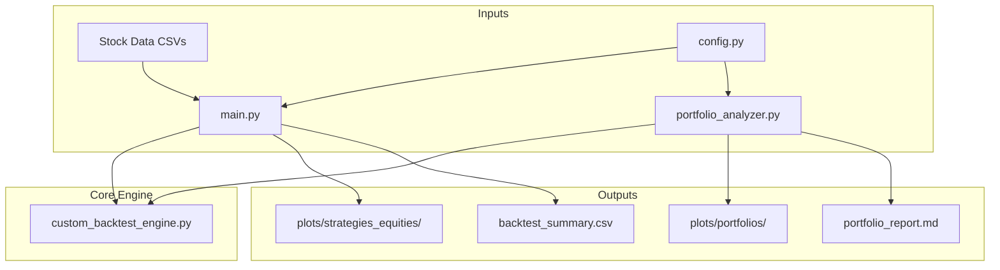

That's a fantastic question. It shows you're thinking not just about the present functionality but also about the long-term health and maintainability of the project.

Overall, the current organization of the code is **very good** and follows sound software engineering principles, especially the separation of concerns. You have:
1.  **Configuration** (`config.py`)
2.  **Core Logic/Engine** (`custom_backtest_engine.py`)
3.  **Analysis Scripts** (`main.py`, `portfolio_analyzer.py`)

This is a logical and effective structure. For a project of this size, it's excellent. However, as projects grow, the "best" structure often evolves. If you plan to continue adding significant new features, some refactoring could be beneficial down the line.

I'll add a new section to the documentation outlining these potential future improvements. This serves as a great roadmap for future development.

---

Here is the complete documentation file, now with the requested **"Future Modifications & Refactoring"** section added at the end.

# AI Stock Strategy - Architecture & User Guide

## 1. Overview

This project is a powerful and flexible event-driven backtesting environment for stock trading strategies. It allows users to test strategies on individual equities and analyze their combined performance at a portfolio level. The system is designed to simulate real-world portfolio management concepts, including cash allocation and annual rebalancing, providing deep insights into the risk/reward profile of different automated trading approaches.

## 2. Software Architecture

The system is composed of several key Python files that work together. The core principle is a separation of concerns: the engine is for calculation, the main scripts are for analysis, and the configuration is centralized.

### `config.py`
This is the central control panel for the entire project. It contains all the high-level settings that a user would want to tweak for an analysis run.

-   **Purpose:** To define global parameters like date ranges, portfolio allocation rules, and plotting preferences without having to modify the core logic of the analysis scripts.
-   **Key Variables:** `START_DATE`, `END_DATE`, `Percent_Cash_Portfolio`, `Cash_Yearly_Rtn`, `Rebalance_Portfolio_Yearly`, plotting flags.

### `custom_backtest_engine.py`
This is the heart of the backtester. It contains the core logic for processing historical data day-by-day and executing trades based on signals from a given strategy.

-   **`BacktestEngine` Class:** The main engine. It takes historical data and a strategy object, loops through the data, manages the state (cash, position), and records all trades and the daily equity value.
-   **`Strategy` Base Class:** An abstract parent class that defines the interface for all trading strategies. Any new strategy *must* inherit from this class and implement the `generate_signals` method.
-   **Strategy Implementations:** This file contains the concrete definitions for all trading strategies (e.g., `BreakoutVer2Strategy`, `TwoStdDevStrategy`). Each class holds its own parameters and state.
-   **Data Classes (`Trade`, `Position`):** Simple data containers used by the engine to store information about open positions and closed trades.

### `main.py`
This script is the **individual equity analyzer**. It is used to test each strategy against each stock file one-by-one.

-   **Purpose:** To generate performance metrics and equity curve plots for every combination of strategy and stock.
-   **Workflow:**
    1.  Loads the list of `STRATEGIES`.
    2.  Loops through every `.csv` file in the `stockData` directory.
    3.  For each stock, it loops through every strategy.
    4.  It instantiates the `BacktestEngine` and runs the backtest.
    5.  It saves the detailed trade log and generates an equity plot (including a Buy & Hold comparison) into a dedicated subdirectory for that strategy under `plots/strategies_equities/`.
    6.  It compiles summary statistics into `backtest_results.txt` and `backtest_summary.csv`.

### `portfolio_analyzer.py`
This script is the **portfolio-level simulator**. It analyzes the performance of strategies when applied across a whole basket of stocks, including sophisticated cash management and rebalancing rules.

-   **Purpose:** To understand the macro performance of a strategy, accounting for diversification, cash drag, and rebalancing effects.
-   **Workflow:**
    1.  Loads settings from `config.py`.
    2.  Calculates the initial capital split between the "invested" and "cash" portions.
    3.  For each strategy, it runs a backtest on every stock to get its individual equity curve.
    4.  It aggregates these individual curves into a single `invested_portfolio_equity` curve.
    5.  Based on the `Rebalance_Portfolio_Yearly` flag, it either:
        -   **(Static Allocation):** Calculates the growth of the cash portion independently and adds it to the invested portion.
        -   **(Rebalancing):** Runs a day-by-day simulation, growing the cash and invested portions and rebalancing them back to the target allocation at the start of each year.
    6.  It generates plots and a final `portfolio_report.md` that compares the performance of all strategies against relevant benchmarks (100% Equity B&H and cash-adjusted B&H).

### Data Flow Diagram



## 3. User Guide

### Prerequisites
-   An Anaconda environment with Python 3.x.
-   Required packages: `pandas`, `numpy`, `matplotlib`.

### Setup
1.  **Directory Structure:** Ensure your project has the following structure:
    ```
    AIStockStrategy/
    ├── stockData/
    │   ├── AAPL_1d.csv
    │   ├── QQQ_1d.csv
    │   └── ... (other stock files)
    ├── swing_trading_strategies/
    │   ├── __init__.py
    │   ├── config.py
    │   ├── main.py
    │   ├── portfolio_analyzer.py
    │   ├── custom_backtest_engine.py
    │   └── ... (other helper files)
    └── ... (other project files)
    ```
2.  **Install Packages:** Activate your conda environment and run `conda install pandas numpy matplotlib`.

### Configuration
All primary settings are controlled in `swing_trading_strategies/config.py`.

-   `START_DATE`/`END_DATE`: Set the date range for all analyses.
-   `Percent_Cash_Portfolio`: The percentage (0.0 to 1.0) of the portfolio to hold in a risk-free cash position.
-   `Cash_Yearly_Rtn`: The annual interest rate the cash portion earns.
-   `Rebalance_Portfolio_Yearly`: `True` or `False`. If `True`, the portfolio will be reset to the target cash percentage annually.
-   `Use_Log_Plots_Portfolio`/`Use_Log_Plots_Equities`: `True` or `False`. Toggles a logarithmic y-axis on the generated charts.

### Defining Strategies
Strategies are defined in `main.py` (and implemented in `custom_backtest_engine.py`). To add or modify a test case, edit the `STRATEGIES` list in `main.py`:

```python
# In main.py
STRATEGIES = [
    # Tuple format: ("Unique Strategy Name", lambda: StrategyClass(param1=value, ...))
    ("Breakout_Simple", lambda: BreakoutStrategy(breakout_period=20, sl=0.95)),
    
    ("BreakoutV2_Full_Features", lambda: BreakoutVer2Strategy(
        use_trailing_stop=True,
        trailing_stop_perc=0.10,
        max_pyramids=5
    )),
    # ... add other strategies here
]
```

### Running the Analysis
Open your terminal, navigate to the `swing_trading_strategies` directory, and run the scripts.

1.  **To analyze individual stock performance:**
    ```bash
    python main.py
    ```
2.  **To analyze portfolio-level performance:**
    ```bash
    python portfolio_analyzer.py
    ```

### Understanding the Output
The scripts will generate several files and directories:

-   `plots/strategies_equities/`: Contains subdirectories for each strategy, filled with equity charts for every individual stock.
-   `plots/portfolios/`: Contains portfolio equity charts comparing each strategy against benchmarks.
-   `backtest_summary.csv`: A CSV file with detailed performance metrics from `main.py`.
-   `portfolio_report.md`: The final markdown report from `portfolio_analyzer.py` summarizing portfolio performance.

## 4. Example Use Case

**Goal:** I want to see if holding a large 50% cash position can protect a simple breakout strategy during market crashes, and I want to compare the results of a disciplined annual rebalancing approach versus a static allocation.

#### Step 1: Configure `config.py` for the First Run
Set the allocation but disable rebalancing to get a baseline.

```python
# In config.py
Percent_Cash_Portfolio = 0.50
Cash_Yearly_Rtn = 0.03
Rebalance_Portfolio_Yearly = False # <-- Set to False for the first run
Use_Log_Plots_Portfolio = True```

#### Step 2: Run the Portfolio Analyzer
Execute the script from the terminal:
```bash
python portfolio_analyzer.py
```

#### Step 3: Analyze the "Static Allocation" Results
Open `portfolio_report.md`. You will see a table similar to this:

| Strategy | Final Portfolio Value [$] | CAGR [%] | Max Drawdown [%] |
|:---|---:|---:|---:|
| 100% Equity B&H | $13,603,969.9 | 22.7 | -59.0 |
| B&H with 50% Cash | $6,841,984.9 | 19.1 | -54.9 |
| Breakout_Simple | $5,504,565.9 | 18.0 | -48.1 |

**Interpretation:** Holding 50% cash significantly reduced the drawdown of the `Breakout_Simple` strategy (from -59% to -48.1%) but also lowered the CAGR. The portfolio still experienced a large drawdown because the equity portion was allowed to grow and dominate the portfolio over time.

#### Step 4: Configure and Run the Second Test
Now, enable rebalancing to enforce the 50/50 split annually.

```python
# In config.py
Rebalance_Portfolio_Yearly = True # <-- Change to True
```

Run the script again:
```bash
python portfolio_analyzer.py
```

#### Step 5: Analyze the "Rebalancing" Results
Refresh `portfolio_report.md`. The table will now look vastly different:

| Strategy | Final Portfolio Value [$] | CAGR [%] | Max Drawdown [%] |
|:---|---:|---:|---:|
| 100% Equity B&H | $13,603,969.9 | 22.7 | -59.0 |
| B&H with 50% Cash | $1,757,908.4 | 12.7 | -27.0 |
| Breakout_Simple | $1,598,345.0 | 12.2 | -25.2 |

**Interpretation:** Annual rebalancing has dramatically cut the max drawdown in half (from -48.1% to -25.2%). This discipline of selling stocks after good years to get back to 50% cash protected the portfolio. The trade-off is a lower CAGR (12.2% vs. 18.0%), as the strategy was not able to let its winners compound freely.

This use case demonstrates how the tool can be used to gain deep insights into the impact of portfolio management decisions on strategy performance.

## 5. Future Modifications & Refactoring

The current architecture is robust and effective. However, as the project grows in complexity, the following refactoring steps could enhance maintainability and flexibility.

### 5.1. Decouple Strategy Definitions
Currently, the list of strategies to be tested is hard-coded in `main.py` and imported by `portfolio_analyzer.py`. The strategy class implementations themselves reside in `custom_backtest_engine.py`.

-   **Proposed Change:**
    1.  Move all strategy class definitions (e.g., `BreakoutVer2Strategy`, `TwoStdDevStrategy`) into their own dedicated file, for example, `strategies.py`. This would make `custom_backtest_engine.py` purely about the engine itself.
    2.  Create a `strategy_config.py` file to hold the `STRATEGIES` list. This would allow both `main.py` and `portfolio_analyzer.py` to import the exact same list of tests without `portfolio_analyzer.py` needing to depend on `main.py`.
-   **Benefit:** Improves separation of concerns and makes the project modules more independent and reusable.

### 5.2. Create a Shared Utilities Module
Functions for calculating metrics (like CAGR and drawdown) and generating plots are currently duplicated or tightly coupled within `main.py` and `portfolio_analyzer.py`.

-   **Proposed Change:** Create a `utils.py` or `reporting.py` module.
    -   Move the `plot_portfolio_equity` and `plot_equity_curve` functions into this module.
    -   Move metric calculation logic (e.g., `generate_summary_from_trades` and the CAGR formula) into this module.
-   **Benefit:** Reduces code duplication (DRY principle) and makes it easier to maintain and update reporting and plotting logic in one central place.

### 5.3. Implement a Data Loader Class
Data loading is currently handled directly inside the `main` functions of the analysis scripts.

-   **Proposed Change:** Create a `DataLoader` class in a new `data_loader.py` file. This class would be responsible for:
    1.  Finding all `.csv` files in the `stockData` directory.
    2.  Loading, parsing dates, and filtering them based on the `START_DATE` and `END_DATE` from the config.
    3.  Creating the `common_index` for portfolio analysis.
-   **Benefit:** Encapsulates all data-handling logic. The analysis scripts would become cleaner, simply calling `loader = DataLoader(config)` and then `loader.get_stock_data()` or `loader.get_common_index()`.

### 5.4. Advanced: Command-Line Interface (CLI)
For even greater flexibility, the reliance on `config.py` could be supplemented with a command-line interface.

-   **Proposed Change:** Use Python's `argparse` library to allow users to override key config parameters directly from the command line.
    ```bash
    # Example
    python portfolio_analyzer.py --rebalance False --cash-pct 0.10
    ```
-   **Benefit:** Allows for rapid testing of different portfolio configurations without constantly editing the `config.py` file. This is ideal for scripting and automating parameter sweeps.